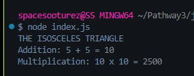

> `export` & `import` vs `module.export` & `require` <br><br>

## <ins> ES Modules </ins> (`export` & `import`) - It is preferred for frontend developement and newer *Node.js* versions.
- Uses `export` keyword to define what gets exported.
- Imported using `import` keyword in another file.
- Keeps code more organized

> ```ECMAScript is the standard that JavaScript follows, and ES6 was an update to the language that introduced many modern features - such as `import` and `export` ```

## <ins>CommonJS</ins> ( `module.exports` & `require()`) - Used in *Node.js* before ES6 modules were widely supported. 
- Defines what gets exported from a file using `module.exports`.
- Imported using `require()` in another file.

<br><br>
>NOTE: `require` and `module.exports` can be used if the type is specified as *commonjs* in the `package.json` file. However *commonJS* is not supported by modern browsers. Since we are working with modern JavaScript projects we will use `export` and `import` way of execution.

